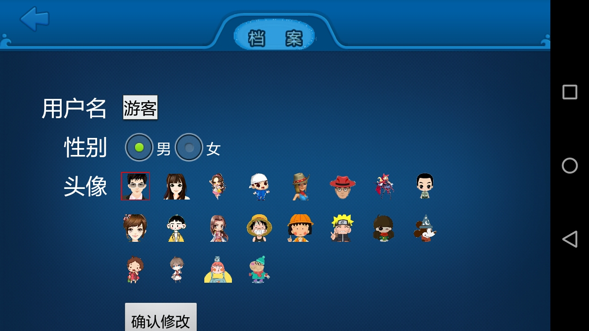
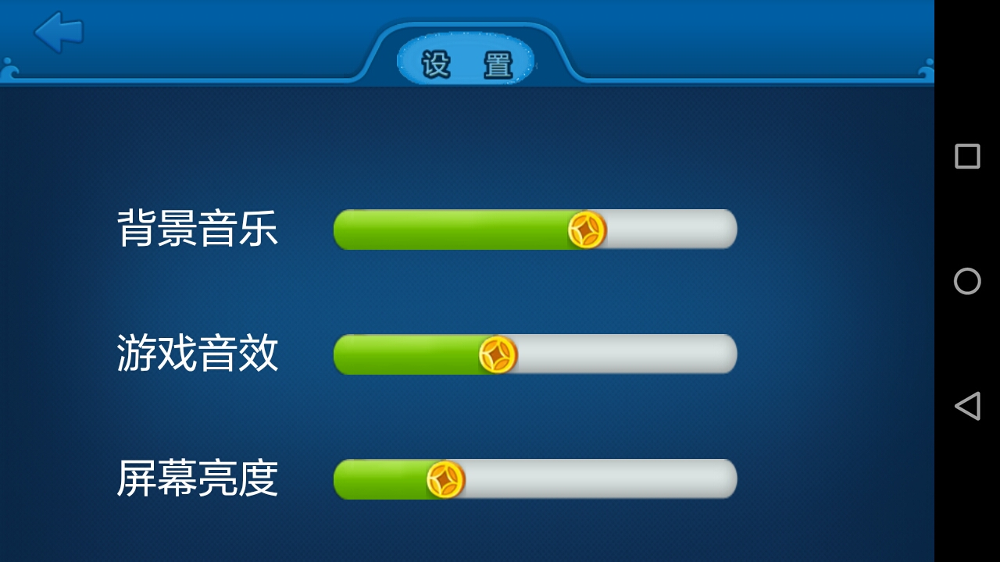
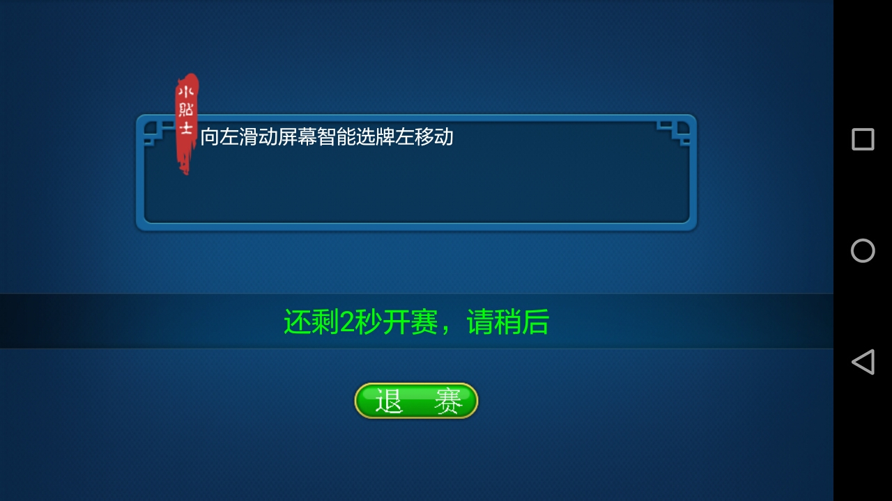
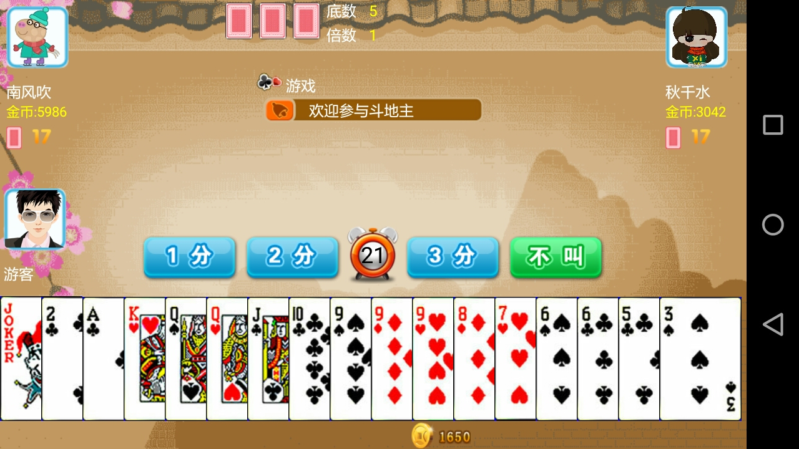
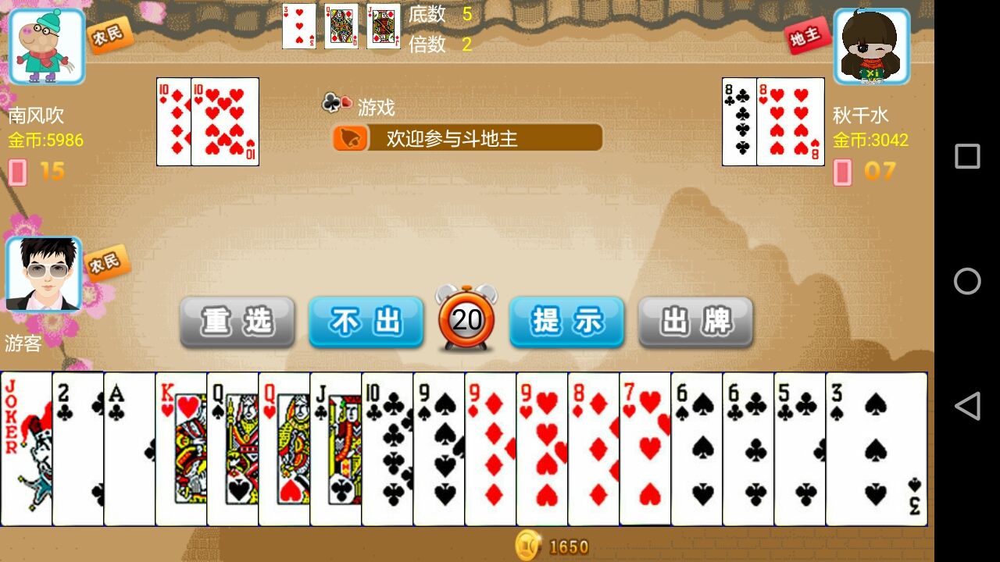

# DouDe-Zhu
DouDe Zhu is very popular in China. 

# Environment

Android developer tools(ADT): v22.3.0-887826

OS platform: Win7

Java compile version: Java 1.6

Android project build target: Android 4.4.2 

Chinese name of the game : 斗地主游戏

# Demonstration

